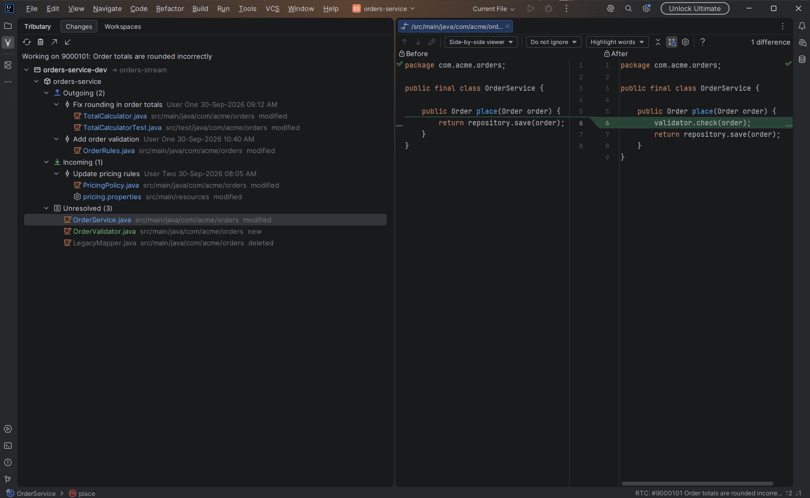
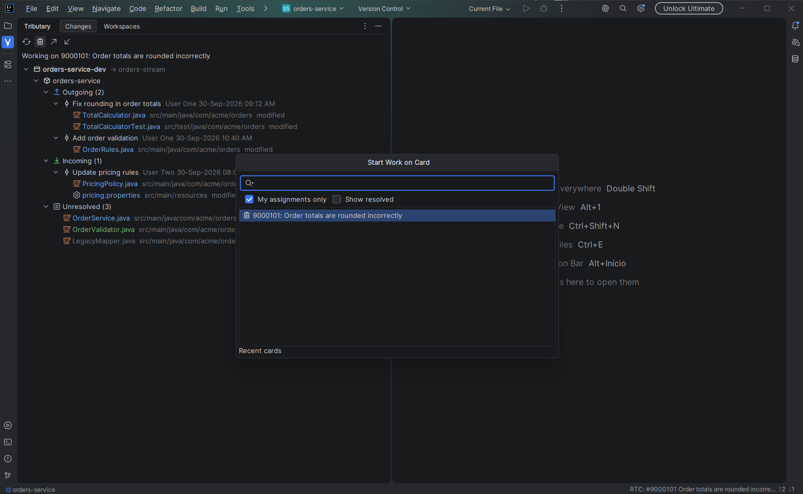
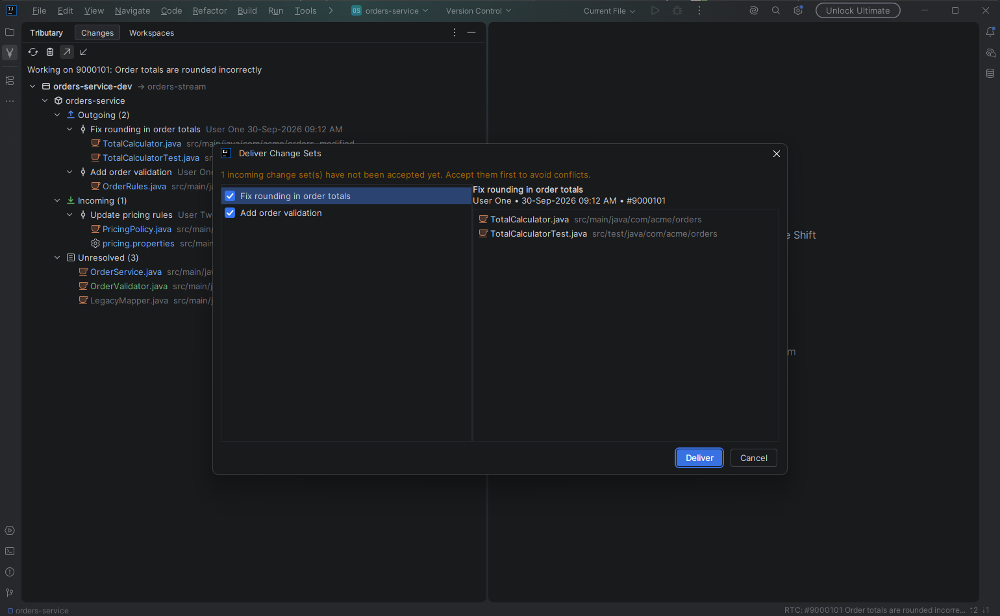
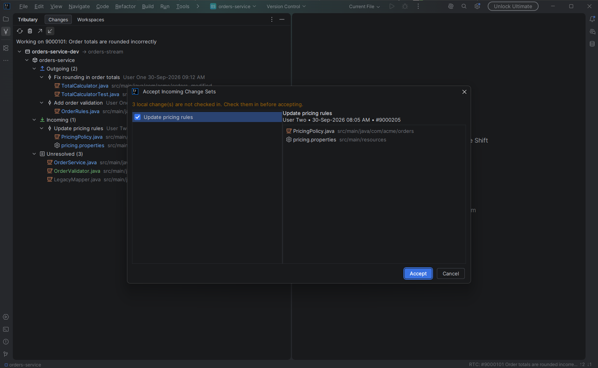
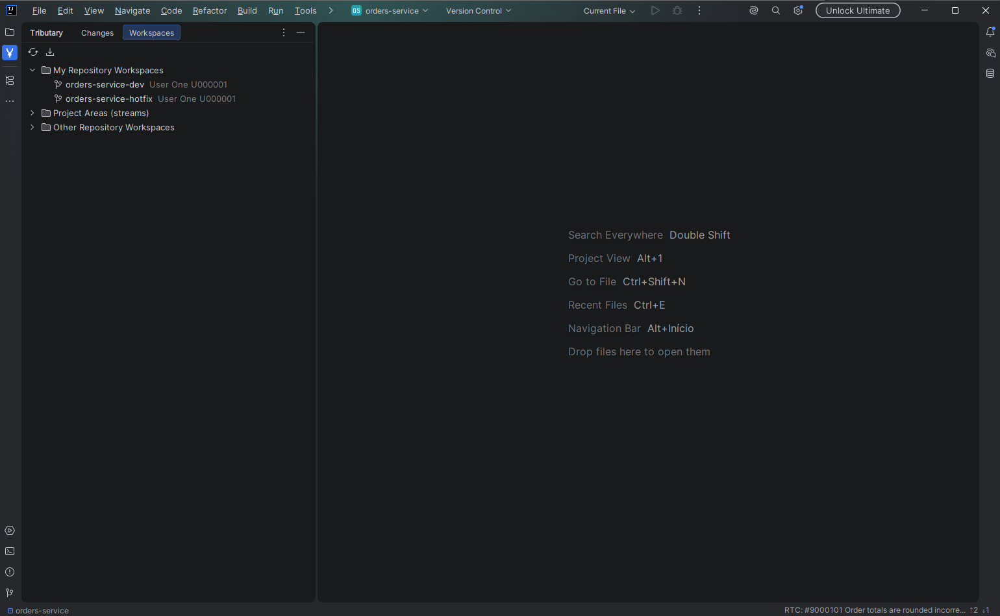
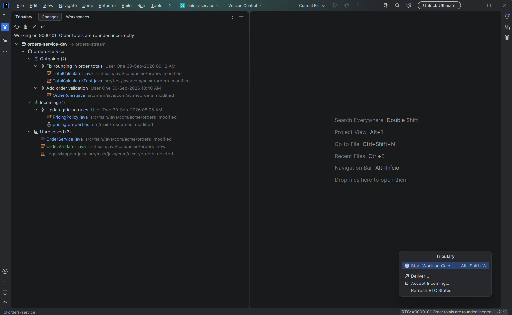

# Tributary

[](https://github.com/TelesNascimento/tributary/actions/workflows/ci.yml)
[](LICENSE)


Tributary brings IBM Engineering Workflow Management (RTC) source control into IntelliJ IDEA, so day-to-day
work does not need the Eclipse client. It works on the sandbox folder directly: no *Team > Share Project* step.

> Early preview. Tributary is not affiliated with or endorsed by IBM.



## What it does

- **Sandbox detection.** Any project inside a folder with a `.jazz5` directory is mapped to the RTC version
  control system automatically.
- **Native Commit window.** Unresolved changes show up in Local Changes and Unversioned Files, with the
  standard side-by-side diff. Check in from the Commit tool window.
- **Work item context.** Pick the work item (card) you are working on once, with `Alt+Shift+W`. Check-ins go
  into change sets linked to it, so delivering is never rejected at the last second for a missing work item.
  Switching cards can suspend the previous card's checked-in changes and resumes them when you come back.
- **Deliver and Accept with a preview.** Review change sets and their files, open a diff for any file, then
  confirm. Optional *Deliver after check-in* in the commit panel.
- **Overview tool window.** Outgoing, incoming and unresolved changes per component, with expandable change
  sets and diffs.
- **Undo and `.jazzignore`.** Undo through the standard Rollback action; *Add to .jazzignore* from the
  changes context menu.
- **Repository workspaces.** Browse your workspaces and streams, create a new workspace from a stream, load
  it into a sandbox and unload it again.

| Start work on a card | Deliver |
|---|---|
|  |  |

| Accept incoming | Repository workspaces |
|---|---|
|  |  |

The screenshots use fictional data produced by the scripts in [`tools/demo`](tools/demo).

## Requirements

- IntelliJ IDEA 2025.2 or later (Community or Ultimate).
- The RTC/EWM SCM command line (`scm`), version 6.0 or later, installed locally. It ships with the RTC
  Eclipse client under `scmtools/eclipse`.
- For work item search: a Java 8 runtime and the RTC client libraries from a local RTC client installation.
  Tributary never bundles or redistributes IBM code.

The command line behavior was verified against RTC 6.0.4. Other 6.x versions are expected to work but are
untested.

## Install

Tributary is not on the JetBrains Marketplace yet. Install it from GitHub. The
[user guide](docs/USER_GUIDE.md) has the full walkthrough with screenshots and troubleshooting.

**One command (Windows, close the IDE first)**

```powershell
irm https://raw.githubusercontent.com/TelesNascimento/tributary/main/tools/install.ps1 -OutFile install.ps1
powershell -ExecutionPolicy Bypass -File .\install.ps1
```

**Or by hand:** download `tributary-<version>.zip` from the
[releases page](https://github.com/TelesNascimento/tributary/releases), then use *Settings > Plugins > gear
icon > Install Plugin from Disk...* and restart the IDE.

Release zips come without the work item bridge, because it needs IBM client libraries that cannot be
redistributed. Everything else works. To search work items, build from source with the libraries of your own RTC
client: see [CONTRIBUTING.md](CONTRIBUTING.md).

## Getting started

1. *Settings > Version Control > Tributary*: the path to `scm.exe` is detected automatically.
2. Add your connection (server URI and user). The password is kept in the IDE password safe. Connections
   already stored by the `scm` command line can be imported. If a command reports that a login is required,
   run `scm login` once in a terminal.
3. Open a project that lives inside a sandbox. The status bar shows the current card and the number of
   outgoing and incoming change sets.
4. Press `Alt+Shift+W`, choose a card and start working. Commit as usual.



## Contributing and security

See [CONTRIBUTING.md](CONTRIBUTING.md) for building from source and the project layout, and
[SECURITY.md](SECURITY.md) and the [Code of Conduct](CODE_OF_CONDUCT.md). Release notes are in
[CHANGELOG.md](CHANGELOG.md).

## License

MIT. See `LICENSE`.
