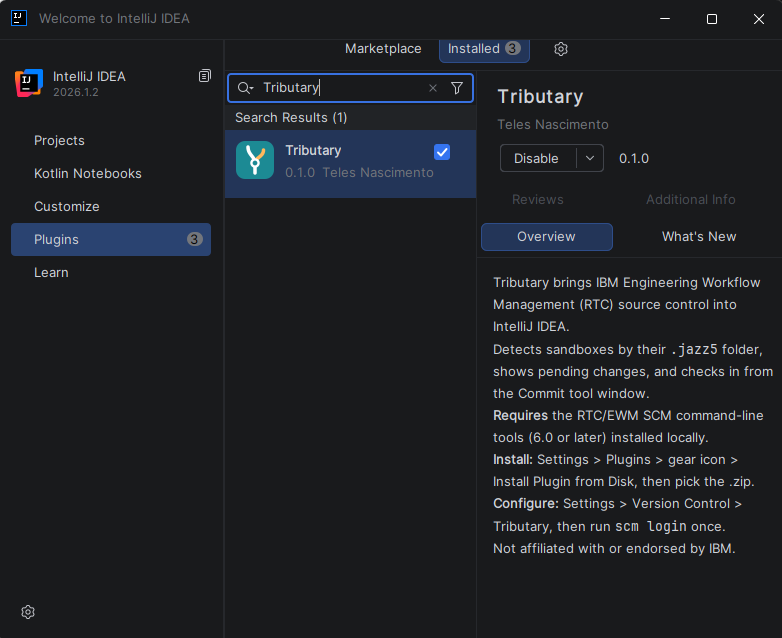
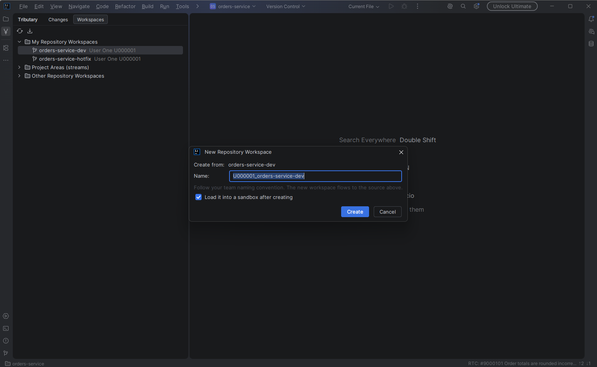

# Tributary user guide

This guide takes you from nothing to your first check-in. It assumes Windows and an RTC/EWM sandbox
(a folder that contains a `.jazz5` directory) that you already use with the Eclipse client.

## 1. Before you start

| You need | How to check |
|---|---|
| IntelliJ IDEA 2025.2 or later, Community or Ultimate | *Help > About* |
| The RTC/EWM `scm` command line, 6.0 or later | It ships with the RTC Eclipse client, in `scmtools\eclipse\scm.exe` |
| A sandbox on disk | The folder has a `.jazz5` directory |

Tributary does not need the Eclipse client to be open. It only needs `scm.exe` to exist.

## 2. Install

### Option A: one command (recommended)

Close IntelliJ IDEA, then run this in PowerShell:

```powershell
irm https://raw.githubusercontent.com/TelesNascimento/tributary/main/tools/install.ps1 -OutFile install.ps1
powershell -ExecutionPolicy Bypass -File .\install.ps1
```

The script downloads the latest release from GitHub and unpacks it into the plugins folder of your newest
IntelliJ IDEA. You can read `install.ps1` before running it. Useful switches:

| Switch | Effect |
|---|---|
| `-Version v0.2.0` | Install a specific release |
| `-AllIdes` | Install into every IntelliJ IDEA found |
| `-NoUpdateRepository` | Do not register the update repository |
| `-PluginsDir <path>` | Install into a specific plugins folder |
| `-Zip <file>` | Install from a zip you already have |

### Option B: from inside the IDE

1. Download `tributary-<version>.zip` from the [releases page](https://github.com/TelesNascimento/tributary/releases).
2. Open *Settings > Plugins*, click the gear icon and choose *Install Plugin from Disk...*.
3. Pick the zip, accept the third-party plugin notice and restart the IDE.

### Check that it worked

Open *Settings > Plugins > Installed* and search for **Tributary**. It should be listed and enabled.



### Uninstall

Use *Settings > Plugins > Installed > Tributary > Uninstall*. Updates are covered in section 6.

## 3. Connect to your server

1. In IntelliJ IDEA open *Settings > Version Control > Tributary*. The path to `scm.exe` is detected
   automatically. If it is not, point it to `scmtools\eclipse\scm.exe`.
2. Add your connection (server URI and user). Your password stays in the IDE password safe. Connections that
   the `scm` command line already knows can be imported.
3. If a command reports that a login is required, log in once from a terminal. Type your password when it
   asks for it, and never put it on the command line:

   ```
   scm login -r https://your-server/ccm/ -u your.user
   ```

## 4. Open your sandbox

Use *File > Open* and choose the sandbox folder (the one with `.jazz5`). Tributary maps the project to the
RTC version control system by itself. There is no *Team > Share* step.

The Tributary tool window lists what is going on in the workspace: outgoing, incoming and unresolved changes
for each component. The status bar shows the current card and the number of outgoing and incoming change sets.


## 5. Daily work

### Pick a card

Press `Alt+Shift+W` (or use the status bar menu) and choose the card you are working on. You choose it once.
From then on every check-in goes into a change set linked to that card.

If the search finds nothing, or work item search is not available in your installation, type the card number
and press Enter. Tributary uses that number as typed, without loading the card summary.


### Check in

Edit files as usual and use the Commit tool window. Changed files appear in Local Changes, new files in
Unversioned Files. Double-click any file for the side-by-side diff.

### Deliver

Use *Deliver...* in the Tributary tool window, or tick *Deliver after check-in* in the commit panel. You see
each change set and its files before anything is sent.


Tributary never delivers on its own. If the workspace has incoming changes, it warns you so you can accept
them first.

### Accept incoming changes

Use *Accept Incoming...* to review and accept what your team delivered.


### Create, load and unload a repository workspace

Open the *Workspaces* tab. It lists your repository workspaces, the other workspaces on the server and the
streams of each project area. Right-click an entry to see what you can do with it.


| Action | Where | What it does |
|---|---|---|
| *New Workspace From Here...* | A stream or a workspace | Creates a repository workspace that flows to it. The name is suggested from your user id and the source. Follow your team's naming convention |
| *Load...* (or double-click) | A stream or a workspace | Downloads the components you pick into a folder |
| *Unload From This Sandbox...* | One of your workspaces | Removes the workspace from the sandbox that is open in the IDE. You choose to keep or delete the files |



Tick *Load it into a sandbox after creating* in the new workspace dialog to go straight from creation to
loading. A name cannot contain `@`, because the command line reads it as a repository suffix.

Creating a workspace writes to the server, so it shows up for your whole team. Tributary never delivers to a
stream on its own.

## 6. Updates

The installer registers the Tributary update repository in your IDE. From then on IntelliJ IDEA checks it by itself
and shows a notification when a new version is out. Click *Update* and restart the IDE. Nothing to download.

To get updates without waiting for the notification, open *Settings > Plugins > Installed*, or turn on
*Update Plugins Automatically* in the gear menu.

If you installed the zip by hand, add the repository once:

1. Open *Settings > Plugins*, click the gear icon and choose *Manage Plugin Repositories...*.
2. Click **+** and paste:

   ```
   https://github.com/TelesNascimento/tributary/releases/latest/download/updatePlugins.xml
   ```

3. Click *OK*.

Update checks only read that file from GitHub. If you prefer not to use it, run the installer with
`-NoUpdateRepository`, or update by running the installer again.

## 7. Troubleshooting

| Symptom | What to do |
|---|---|
| The project is not recognized as an RTC sandbox | Open the folder that directly contains `.jazz5`, not a parent or a subfolder |
| "scm not found" | Set the path in *Settings > Version Control > Tributary* |
| "Login required" | Run `scm login` again in a terminal. Sessions expire |
| Tributary does not appear in the plugin list | Check that the IDE is 2025.2 or later. Restart the IDE after installing |
| Card search finds nothing | Type the card number and press Enter. Search needs the work item bridge, which release zips do not include. Build from source with `ibmPlugins` set to have it, see [CONTRIBUTING.md](../CONTRIBUTING.md) |
| "Java 8 runtime" message | Only needed for search. Set the folder in *Settings > Version Control > Tributary*, or use the card number instead |
| An action fails | The error notification shows the message from `scm`. Attach it when you open an issue |

## 8. Getting help

Open an [issue](https://github.com/TelesNascimento/tributary/issues/new/choose). Do not paste passwords, tokens
or internal server names.
